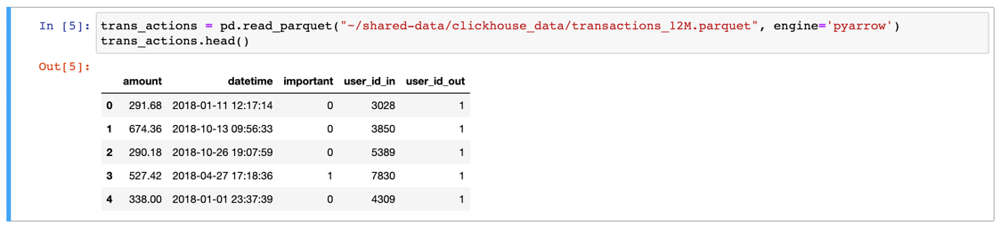

# Lab 3 — ClickHouse Lab

> <picture>
>   <source media="(prefers-color-scheme: light)" srcset="https://raw.githubusercontent.com/Mqxx/GitHub-Markdown/main/blockquotes/badge/light-theme/warning.svg">
>   
> </picture><br>
> 
> **PLAGIARISM IS PROHIBITED!**
> <details>
>  <summary>Collapse</summary>
>
> ⠀⠀⠀⠀⠀⠀⠀⢀⣠⣤⣤⣵⣶⣤⣄⣀⡄⠀⠀⠀⠀⠀⠀⠀⠀⠀⠀⠀⠀⠀
> ⠀⠀⠀⠀⠀⠀⣠⣿⣿⣿⣿⣿⣿⣿⣿⣿⣷⣶⠀⠀⠀⠀⠀⠀⠀⠀⠀⠀⠀⠀
> ⠀⠀⠀⠀⠀⠛⢻⣻⡛⠛⠛⣛⣛⡛⢹⣿⡿⠍⡧⡀⠀⠀⠀⠀⠀⠀⠀⠀⠀⠀
> ⠀⠀⠀⠀⠀⣜⠁⠀⠙⡤⣎⠀⠀⠙⡍⠉⠀⠀⠀⠘⢄⠀⠀⠀⠀⠀⠀⠀⠀⠀
> ⠀⠀⠀⢀⠖⠙⢄⠔⠒⠃⠹⣀⣀⠔⠁⠀⠀⠀⠀⠀⠘⡆⠀⠀⠀⠀⠀⠀⠀⠀
> ⠀⠀⢠⠃⠀⠀⠘⣄⣀⣠⠄⠀⠀⣀⠀⠀⠀⠀⠀⠀⠀⠘⡀⠀⠀⠀⠀⠀⠀⠀
> ⠀⠀⡘⠀⠀⠀⠘⠒⠀⠀⣴⣶⣿⣿⣷⠀⠀⠀⠀⠀⠀⠀⢣⠀⠀⠀⠀⠀⠀⠀
> ⠀⠀⢃⠀⠀⠀⠀⠀⠀⠀⢸⣿⣿⣿⢿⡇⠀⠀⠀⠀⠀⠀⠈⡆⠀⠀⠀⠀⠀⠀
> ⠀⠀⢸⠀⠀⠀⠀⡠⠤⠤⠼⠿⠯⠤⠜⠀⠀⠀⠀⠀⠀⠀⠀⠱⡀⠀⠀⠀⠀⠀
> ⠀⠀⠈⡇⠀⠀⠀⠙⢄⠀⠀⠀⠀⠀⠀⠀⠀⠀⠀⠀⠀⠀⠀⠀⠈⠑⢄⠀⠀⠀
> ⠀⠀⠀⣷⠀⠀⠀⡴⠋⠀⠀⠀⠀⠀⡀⠀⠀⠀⠀⠀⠀⠀⠀⠀⠀⠀⠀⠑⢄⠀
> ⠀⡠⠊⠈⠆⠀⠀⢧⡀⠀⣠⡀⠀⢀⡇⠀⠀⠀⠀⠀⠀⠀⠀⠀⠀⠀⠀⠀⠈⠢
> ⡜⠁⠀⠀⠀⠀⠀⠀⠉⠉⠀⠉⠉⠉⠀⠀⠀⠀⠀⠀⠀⠀⠀⠀⠀⠀⠀⠀⠀⠀
> </details>

## Dataset
> <picture>
>   <source media="(prefers-color-scheme: light)" srcset="https://raw.githubusercontent.com/Mqxx/GitHub-Markdown/main/blockquotes/badge/light-theme/info.svg">
>   
> </picture><br>
> 
> Dataset is presented by a parquet file with users’ transactions. Path to this file:
> `/nfs/shared/clickhouse_data/transactions_12M.parquet`
## Get familiar with data
```
[<YOUR_LOGIN>@gateway ~]$ kubectl get pods
NAME                             READY   STATUS    RESTARTS   AGE
jupyter-spark-7c5b4455cc-fv7dr   1/1     Running   0          51d
[dzaharov-369864@gateway ~]$ kubectl exec -it jupyter-spark-7c5b4455cc-fv7dr -- bash
```
```
(base) <YOUR_LOGIN>@jupyter-spark-7c5b4455cc-fv7dr:~/shared-data/clickhouse_data$ head -5 transactions_12M.parquet
PAR1??a??:Lš
            ??0{?G?:r? ,"r@???(\{?@, u@H?z??`@3??~@?p=
ן~@?????N?@??(\??x@=
ףp#?$=T@??Q?nW	8sF	H$у@???Q?\	`$?r@?(\???	0
                                                         ?@f?? $jp@ףp=
xq?     ??-(?x ?b?      8?)?A? ?8=V)    (??	h??	 s	?$p@)\???@a	h?	??	?q	?z	P?z	?)?	?(?@?G?zX?@=P????f?g	??@ׅ!    8+?	??a@(?	x??	 1
                                    ??@q!?$?	x?	`?*	?
                                                                 ao@R!??>	Hn?	(?g	PĂ	??u	??-H(?)8?v	?Fu	?M|	8&q	xr?    ??)??	H$?{@?????t	?ɂ	Pv?)H??	H??	??	8t	P.?	$*?@?Q??݁	P%t	h?	
                                                                                                                                                                                                                                                                        A)?cZ	h݅?c	h?M??b)P???	0+M?y?)???	x??	h??)\	h
??}??I??^?m?xmpbXއ}    ??VI     ?܄)?΀   ??r)0??I?߇?	)?s)?mr)???)86vD??	??o	?Bi     H?r)ދ)??q)??~)`??I(??	?Ό)?|	?Sh	͂PlԄIX??????? ?m?k?q	x?x	`?|	p?	`xy)?q	@|V	P?
```
## Go to look through http://node03.st:32074/
```py
trans_actions = pd.read_parquet("~/shared-data/clickhouse_data/transactions_12M.parquet", engine='pyarrow')
trans_actions.head()
```

```
	amount	datetime	important	user_id_in	user_id_out
0	291.68	2018-01-11 12:17:14	0	3028	1
1	674.36	2018-10-13 09:56:33	0	3850	1
2	290.18	2018-10-26 19:07:59	0	5389	1
3	527.42	2018-04-27 17:18:36	1	7830	1
4	338.00	2018-01-01 23:37:39	0	4309	1
```


## 1. You have to choose 2 or more MVs ~~or suggest your own MVs~~. The MVs list is located below.
> <picture>
>   <source media="(prefers-color-scheme: light)" srcset="https://raw.githubusercontent.com/Mqxx/GitHub-Markdown/main/blockquotes/badge/light-theme/info.svg">
>   
> </picture><br>
>
> <details>
>  <summary>No Options</summary>
> 
> 1. Average amount for incoming and outcoming transactions by months and days for each user.
> 2. The number of important transactions for incoming and outcoming transactions by months and days for each user.
> 3. The sums for incoming and outcoming transactions by months for each user.
> 4. Users’ saldo for the current moment.
> </details>


# change dash in your login to underscore
```sh
(base) <YOUR_LOGIN>@jupyter-spark-7c5b4455cc-fv7dr:~$ clickhouse-client --host=clickhouse-6.clickhouse.clickhouse \
                    --user=<YOUR_LOGIN> \
                    --password=<YOUR_PASSWORD>
                    

clickhouse-6.clickhouse.clickhouse.svc.cluster.local :)  
```

## 2. Upload the data into the CH cluster. Table for uploaded data has to be the MergeTree family. To distribute data over the cluster you have to use the Distributed engine and sharding expression.
### Firstly let's create a Local Table
```sql
CREATE TABLE dzaharov_369864.users_transactions 
ON CLUSTER kube_clickhouse_cluster
(
    user_id_out Int64,
    user_id_in Int64,
    important Int64,
    amount Float64,
    datetime DateTime
)
ENGINE = MergeTree()
PARTITION BY toYYYYMM(datetime)
ORDER BY (user_id_out, user_id_in, amount);
```
> Here we use `MergeTree` Engine cause it's designed for inserting a very large amount of data into a table. The data is quickly written to the table part by part, then rules are applied for merging the parts in the background. This method is much more efficient than continually rewriting the data in storage during insert.
### Secondly let's create a Distributed Table
```sql
CREATE TABLE dzaharov_369864.distributed_users_transactions
ON CLUSTER kube_clickhouse_cluster AS dzaharov_369864.users_transactions
ENGINE = Distributed(
	kube_clickhouse_cluster,
	dzaharov_369864,
	users_transactions,
	xxHash64(datetime)
);
```
```shell
clickhouse-6.clickhouse.clickhouse.svc.cluster.local :) exit
```

### Then we insert data from shared-data into created tables
```shell
(base) dzaharov-369864@jupyter-spark-7c5b4455cc-fv7dr:~$ cat shared-data/clickhouse_data/transactions_12M.parquet | \
clickhouse-client --host=clickhouse-6.clickhouse.clickhouse \
                  --user=dzaharov_369864 \
                  --ask-password \
                  --query="INSERT INTO dzaharov_369864.distributed_users_transactions FORMAT Parquet"
```
### Let's look through created tables
```shell
DESCRIBE dzaharov_369864.users_transactions
```

## 3. Implement the chosen MVs. Also you are able to create extra tables with different engines if you need them. The number of extra tables should be reasonable.
### 3.1. Average amount for incoming and outcoming transactions by months and days for each user.
#### Average by Month
```sql
CREATE MATERIALIZED VIEW dzaharov_369864.average_amount_by_month
ON CLUSTER kube_clickhouse_cluster
ENGINE = AggregatingMergeTree
ORDER BY (user_id, date) POPULATE AS
WITH count_in AS (
    SELECT
        user_id_in AS user_id,
        formatDateTime(datetime, '%m-%G') AS date,
        ROUND(AVG(amount), 2) AS avg_in
    FROM dzaharov_369864.distributed_users_transactions
    GROUP BY
        user_id,
        date
),
count_out AS (
    SELECT
        user_id_out AS user_id,
        formatDateTime(datetime, '%m-%G') AS date,
        ROUND(AVG(amount), 2) AS avg_out
    FROM dzaharov_369864.distributed_users_transactions
    GROUP BY
        user_id,
        date
)
SELECT
    tci.user_id AS user_id,
    tci.date,
    avg_in,
    avg_out
FROM count_in AS tci
INNER JOIN count_out AS tco ON (tco.user_id = tci.user_id) AND (tco.date = tci.date)
ORDER BY 
    tci.user_id, 
    date;
```

```sql
CREATE TABLE dzaharov_369864.distributed_average_amount_by_month
ON CLUSTER kube_clickhouse_cluster AS
dzaharov_369864.average_amount_by_month
ENGINE = Distributed(
    kube_clickhouse_cluster,
    dzaharov_369864, 
    average_amount_by_month
);
```
>  Here we use Distributed engine cause we do not store any data of their own, but allow distributed query processing on multiple servers. Reading is automatically parallelized. During a read, the table indexes on remote servers are used, if there are any.

```sql
SELECT * FROM dzaharov_369864.distributed_average_amount_by_month
LIMIT 10
```
```
┌─user_id─┬─date────┬─avg_in─┬─avg_out─┐
│       1 │ 01-2018 │ 512.75 │  470.73 │
│       1 │ 02-2018 │ 459.23 │  489.53 │
│       1 │ 03-2018 │ 503.93 │   470.5 │
│       1 │ 04-2018 │ 490.56 │  532.66 │
│       1 │ 05-2018 │ 494.69 │  498.66 │
│       1 │ 06-2018 │ 476.93 │  535.05 │
│       1 │ 07-2018 │ 500.28 │  476.06 │
│       1 │ 08-2018 │ 522.28 │  463.56 │
│       1 │ 09-2018 │ 476.53 │  519.57 │
│       1 │ 10-2018 │  506.8 │  478.15 │
└─────────┴─────────┴────────┴─────────┘
```
#### Average by Day
```sql
CREATE MATERIALIZED VIEW dzaharov_369864.average_amount_by_day
ON CLUSTER kube_clickhouse_cluster
ENGINE = AggregatingMergeTree
ORDER BY (user_id, date) POPULATE AS
WITH count_in AS (
    SELECT
        user_id_in AS user_id,
        formatDateTime(datetime, '%d-%m-%G') AS date,
        ROUND(AVG(amount), 2) AS avg_in
    FROM dzaharov_369864.distributed_users_transactions
    GROUP BY
        user_id,
        date
),
count_out AS (
    SELECT
        user_id_out AS user_id,
        formatDateTime(datetime, '%d-%m-%G') AS date,
        ROUND(AVG(amount), 2) AS avg_out
    FROM dzaharov_369864.distributed_users_transactions
    GROUP BY
        user_id,
        date
)
SELECT
    tci.user_id AS user_id,
    tci.date,
    avg_in,
    avg_out
FROM count_in AS tci
INNER JOIN count_out AS tco ON (tco.user_id = tci.user_id) AND (tco.date = tci.date)
ORDER BY 
    tci.user_id, 
    date;
```

```sql
CREATE TABLE dzaharov_369864.distributed_average_amount_by_day 
ON CLUSTER kube_clickhouse_cluster AS dzaharov_369864.average_amount_by_day
ENGINE = Distributed(
    kube_clickhouse_cluster,
    dzaharov_369864, 
    average_amount_by_day
);
```

```sql
SELECT * FROM dzaharov_369864.distributed_average_amount_by_day
LIMIT 10
```
```
┌─user_id─┬─date───────┬─avg_in─┬─avg_out─┐
│       1 │ 01-01-2018 │ 482.72 │  445.31 │
│       1 │ 01-02-2018 │ 171.74 │  262.45 │
│       1 │ 01-03-2018 │ 548.24 │  230.22 │
│       1 │ 01-05-2018 │ 423.74 │  438.32 │
│       1 │ 01-06-2018 │ 474.84 │  606.02 │
│       1 │ 01-08-2018 │ 328.26 │  391.08 │
│       1 │ 01-09-2018 │ 458.14 │  371.04 │
│       1 │ 01-10-2018 │ 643.31 │  903.74 │
│       1 │ 01-11-2018 │ 128.86 │  238.15 │
│       1 │ 01-12-2018 │ 423.54 │  627.13 │
└─────────┴────────────┴────────┴─────────┘
```

#### Table schemas
```
DESCRIBE dzaharov_369864.distributed_average_amount_by_month
DESCRIBE dzaharov_369864.distributed_average_amount_by_day
```

### 3.2. The number of important transactions for incoming and outcoming transactions by months and days for each user.
#### Important transactions by months
```sql
CREATE MATERIALIZED VIEW dzaharov_369864.important_number_by_month
ON CLUSTER kube_clickhouse_cluster
ENGINE = AggregatingMergeTree
ORDER BY (user_id, date) 
POPULATE AS WITH count_in AS (
    SELECT
        user_id_in AS user_id,
        formatDateTime(datetime, '%m-%G') AS date,
        COUNT(amount) AS cnt_in
    FROM dzaharov_369864.distributed_users_transactions
    WHERE important = 1
    GROUP BY
        user_id,
        date
),
count_out AS (
    SELECT
        user_id_out AS user_id,
        formatDateTime(datetime, '%m-%G') AS date,
        COUNT(amount) AS cnt_out
    FROM dzaharov_369864.distributed_users_transactions
    WHERE important = 1
    GROUP BY
        user_id,
        date
)
SELECT
    tci.user_id AS user_id,
    tci.date AS date,
    cnt_in,
    cnt_out
FROM count_in AS tci
INNER JOIN count_out AS tco ON (tco.user_id = tci.user_id) AND (tco.date = tci.date)
ORDER BY date;
```

```sql
CREATE TABLE dzaharov_369864.distributed_important_number_by_month
ON CLUSTER kube_clickhouse_cluster AS dzaharov_369864.important_number_by_month
ENGINE = Distributed(
    kube_clickhouse_cluster,
    dzaharov_369864, 
    important_number_by_month 
);
```


```sql
SELECT * FROM dzaharov_369864.distributed_important_number_by_month
LIMIT 10
```
```
┌─user_id─┬─date────┬─cnt_in─┬─cnt_out─┐
│       1 │ 01-2018 │     20 │      20 │
│       1 │ 02-2018 │     33 │      17 │
│       1 │ 03-2018 │      9 │      14 │
│       1 │ 04-2018 │     31 │      19 │
│       1 │ 05-2018 │     26 │      18 │
│       1 │ 06-2018 │     21 │      19 │
│       1 │ 07-2018 │     17 │      26 │
│       1 │ 08-2018 │     12 │      13 │
│       1 │ 09-2018 │     22 │      19 │
│       1 │ 10-2018 │     20 │      26 │
└─────────┴─────────┴────────┴─────────┘
```
#### Important transactions by day
```sql
CREATE MATERIALIZED VIEW dzaharov_369864.important_number_by_day
ON CLUSTER kube_clickhouse_cluster
ENGINE = AggregatingMergeTree
ORDER BY (user_id, date) 
POPULATE AS WITH
count_in AS (
    SELECT
        user_id_in AS user_id,
        formatDateTime(datetime, '%d-%m-%G') AS date,
        COUNT(amount) AS cnt_in
    FROM dzaharov_369864.distributed_users_transactions
    WHERE important = 1
    GROUP BY
        user_id,
        date
),
count_out AS (
    SELECT
        user_id_out AS user_id,
        formatDateTime(datetime, '%d-%m-%G') AS date,
        COUNT(amount) AS cnt_out
    FROM dzaharov_369864.distributed_users_transactions
    WHERE important = 1
    GROUP BY
        user_id,
        date
)
SELECT
    tci.user_id AS user_id,
    tci.date AS date,
    cnt_in,
    cnt_out
FROM count_in AS tci
INNER JOIN count_out AS tco ON (tco.user_id = tci.user_id) AND (tco.date = tci.date)
ORDER BY 
    date;
```

```sql
CREATE TABLE dzaharov_369864.distributed_important_number_by_day
ON CLUSTER kube_clickhouse_cluster AS dzaharov_369864.important_number_by_day
ENGINE = Distributed(
    kube_clickhouse_cluster,
    dzaharov_369864, 
    important_number_by_day
);
```


```sql
SELECT * FROM dzaharov_369864.distributed_important_number_by_day
LIMIT 10
```
```
┌─user_id─┬─date───────┬─cnt_in─┬─cnt_out─┐
│       1 │ 01-01-2018 │      1 │       2 │
│       1 │ 01-02-2018 │      1 │       1 │
│       1 │ 02-02-2018 │      5 │       1 │
│       1 │ 02-04-2018 │      1 │       1 │
│       1 │ 02-06-2018 │      1 │       1 │
│       1 │ 03-08-2018 │      1 │       1 │
│       1 │ 03-09-2018 │      1 │       1 │
│       1 │ 03-11-2018 │      2 │       1 │
│       1 │ 03-12-2018 │      1 │       3 │
│       1 │ 04-01-2018 │      1 │       1 │
└─────────┴────────────┴────────┴─────────┘
```

#### Table schemas
```
DESCRIBE dzaharov_369864.distributed_important_number_by_month
DESCRIBE dzaharov_369864.distributed_important_number_by_day
```

### 3.3. The sums for incoming and outcoming transactions by months for each user.
```sql
CREATE MATERIALIZED VIEW dzaharov_369864.sums_io_by_month
ON CLUSTER kube_clickhouse_cluster
ENGINE = AggregatingMergeTree
ORDER BY (user_id, date) POPULATE AS WITH
count_in AS (
    SELECT
        user_id_in AS user_id,
        formatDateTime(datetime, '%m-%G') AS date,
        ROUND(SUM(amount), 2) AS sum_in
    FROM dzaharov_369864.distributed_users_transactions
    GROUP BY
        user_id,
        date
),
count_out AS (
    SELECT
        user_id_out AS user_id,
        formatDateTime(datetime, '%m-%G') AS date,
        ROUND(SUM(amount), 2) AS sum_out
    FROM dzaharov_369864.distributed_users_transactions
    GROUP BY
        user_id,
        date
)
SELECT
    tci.user_id AS user_id,
    tci.date AS date,
    sum_in,
    sum_out
FROM count_in AS tci
INNER JOIN count_out AS tco ON (tco.user_id = tci.user_id) AND (tco.date = tci.date)
ORDER BY 
    user_id, 
    date;
```

```sql
CREATE TABLE dzaharov_369864.distributed_sums_io_by_month
ON CLUSTER kube_clickhouse_cluster AS dzaharov_369864.sums_io_by_month
ENGINE = Distributed(
    kube_clickhouse_cluster,
    dzaharov_369864, 
    sums_io_by_month
);
```


```sql
SELECT * FROM dzaharov_369864.distributed_sums_io_by_month
LIMIT 10
```
```
┌─user_id─┬─date────┬───sum_in─┬──sum_out─┐
│       1 │ 01-2018 │ 48198.36 │ 57899.62 │
│       1 │ 02-2018 │ 54189.28 │ 41120.87 │
│       1 │ 03-2018 │ 44345.88 │ 38580.74 │
│       1 │ 04-2018 │ 50036.76 │ 52733.63 │
│       1 │ 05-2018 │  50458.8 │ 49866.49 │
│       1 │ 06-2018 │ 48170.05 │  62601.2 │
│       1 │ 07-2018 │ 47026.49 │ 54746.38 │
│       1 │ 08-2018 │  56406.6 │ 39402.49 │
│       1 │ 09-2018 │ 47653.15 │ 52476.87 │
│       1 │ 10-2018 │ 50680.35 │ 47336.45 │
└─────────┴─────────┴──────────┴──────────┘
```
#### Table schemas
```
DESCRIBE dzaharov_369864.distributed_sums_io_by_month
```
### 3.4. Users’ saldo for the current moment.
```sql
CREATE MATERIALIZED VIEW dzaharov_369864.users_saldo 
ON CLUSTER kube_clickhouse_cluster
ENGINE = AggregatingMergeTree
ORDER BY (user_id, date) POPULATE AS
WITH count_in AS (
    SELECT
        user_id_in AS user_id,
        datetime AS date,
        ROUND(SUM(amount), 2) AS sum_in
    FROM dzaharov_369864.distributed_users_transactions
    GROUP BY
        user_id,
        date
),
count_out AS (
    SELECT
        user_id_out AS user_id,
        datetime AS date,
        ROUND(SUM(amount), 2) AS sum_out
    FROM dzaharov_369864.distributed_users_transactions
    GROUP BY
        user_id,
        date
)
SELECT
    tci.user_id AS user_id,
    formatDateTime(tci.date, '%m-%G') AS date,
    ROUND((sum_in - sum_out),2) as saldo
FROM count_in AS tci
INNER JOIN count_out AS tco ON (tco.user_id, tco.date) = (tci.user_id, tci.date)
ORDER BY 
    tci.user_id, 
    date;
```

```sql
CREATE TABLE dzaharov_369864.distributed_users_saldo 
ON CLUSTER kube_clickhouse_cluster AS dzaharov_369864.users_saldo
ENGINE = Distributed(
    kube_clickhouse_cluster,
    dzaharov_369864, 
    users_saldo
);
```

```sql
SELECT * FROM dzaharov_369864.distributed_users_saldo
LIMIT 10
```
```
┌─user_id─┬─date────┬───saldo─┐
│       7 │ 05-2018 │       0 │
│      20 │ 03-2018 │       0 │
│      39 │ 01-2018 │       0 │
│      43 │ 08-2018 │ -945.86 │
│      50 │ 05-2018 │ -252.12 │
│      52 │ 01-2018 │       0 │
│      54 │ 12-2018 │       0 │
│      56 │ 02-2018 │       0 │
│      56 │ 04-2018 │       0 │
│      57 │ 06-2018 │       0 │
└─────────┴─────────┴─────────┘
```
```sql
SELECT *
FROM dzaharov_369864.distributed_users_saldo
WHERE saldo != 0
LIMIT 10
```
```
┌─user_id─┬─date────┬───saldo─┐
│      43 │ 08-2018 │ -945.86 │
│      50 │ 05-2018 │ -252.12 │
│      66 │ 04-2018 │  496.58 │
│      78 │ 12-2018 │  706.51 │
│      98 │ 05-2018 │  276.19 │
│     190 │ 02-2018 │  769.78 │
│     207 │ 12-2018 │ -226.03 │
│     227 │ 02-2018 │ -391.29 │
│     257 │ 02-2018 │ -620.02 │
│     266 │ 10-2018 │    9.16 │
└─────────┴─────────┴─────────┘
```

#### Table schemas
```
DESCRIBE dzaharov_369864.distributed_users_saldo
```


## Queries examples that users may request
```sql
SELECT user_id, balance FROM users_balance WHERE balance < 0 LIMIT 20;

SELECT * FROM avg_out_month WHERE user_id = 12345;

SELECT user_id, max(trans_sum) FROM transactions_sum WHERE user_id IN (123, 456, 789, ...) GROUP BY user_id;


DROP VIEW <YOUR_LOGIN>.transaction_view_2 ON CLUSTER kube_clickhouse_cluster
DROP TABLE <YOUR_LOGIN>.distr_transaction_view_2 ON CLUSTER kube_clickhouse_cluster
```

> <picture>
>   <source media="(prefers-color-scheme: black)" srcset="https://raw.githubusercontent.com/Mqxx/GitHub-Markdown/main/blockquotes/badge/light-theme/tip.svg">
>   
> </picture><br>
>
> Если у кого на убунту не работает интренет из-за форти, когда подлкючаетесь к кластеру для бигдаты, вот вроде рабочее решение:
>
> ```
> sudo openfortivpn fgvpn.onti.actcognitive.org:443 -u <YOUR LOGIN> -p <YOUR_PASSWORD> --trusted-cert 7585cc7b3c19fcb8d24b2a33c98638ab799c27f908d8c7b4725c7bf2d4440313 --set-routes true
> ```


> <picture>
>   <source media="(prefers-color-scheme: light)" srcset="https://raw.githubusercontent.com/Mqxx/GitHub-Markdown/main/blockquotes/badge/light-theme/issue.svg">
>   
> </picture><br>
>
> Не критичные замечания:
> important - это по сути флаг `0`/`1`. Для него хватилось бы и `Int8`/`UInt8` (вместо `Int64`).
> 
> Критичные замечания.
> 1. MV "смотрит" на `distributed` таблицу. Такая MV не будет работать. Тут она "сработала" только из-за ключа `POPULATE` (т.е. был выполнен запрос сразу после создания MV). Если бы в таблицу продолжали поступать данные - MV их уже не увидела бы.
> 2. MV, в которых есть `JOIN`, триггерится только на левую часть. Т.е. если данных поступят в правую часть - они не "подхватятся". В нашем случае это не страшно, т.к. у имеем джоин таблицы самой на себя. Но, мы делаем inner join, из-за чего mv может давать неверный результат.
> 
> Пример - поступили следующие записи:
> ```
> user_id_in - user_id_out - amount
> 1234         5678          100500
> 5678         6543          17777
> ```
> 
> Однако созданный mv сохранит только 1 строку:
> ```
> user_id - amount_in - amount_out 
> 678      17777       100500
> ```
> 3. AggregatingMT работает с функциями `*State`, а не простыми агрегационными функциями. Например, вместо `count(...)` и `sum(...)` следовало использовать `countState(...)`, `sumState(...)`.